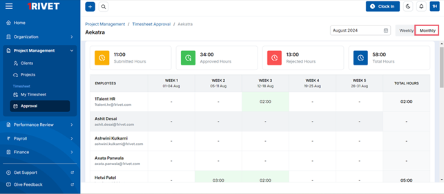
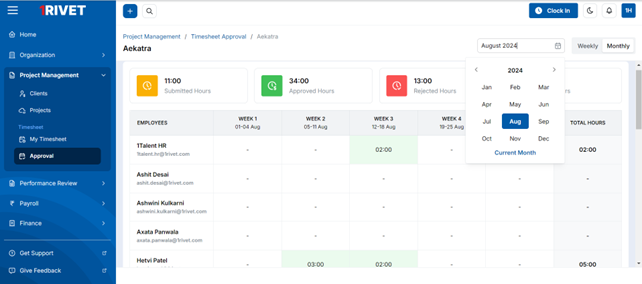
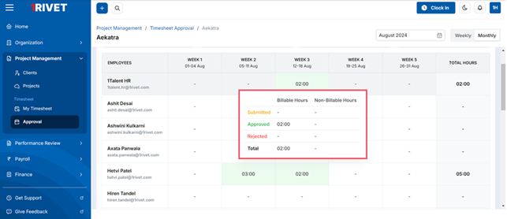

The Reporting manager also has the monthly view for the timesheet, which would serve as a monthly summary of the timesheet for a specific project.

The month and year can be selected from the calendar. By default, the current month would be selected, and its data will be displayed.

The hours which are added will be displayed on each week against each employee. On hovering over the added hours, the manager can see the information regarding the billing type of the hours, i.e.,
billable and non-billable, the submitted hours, the hours that are rejected, the hours that are approved, and the total of all.

**Please note that all the data on the monthly view screen of timesheet is "View Only".**