# View Timesheet

Access the Aekatra web or mobile app and navigate to **“My Timesheet”** from the **“Project
Management”** section. You would be able to view the list of projects in which you are staffed in.

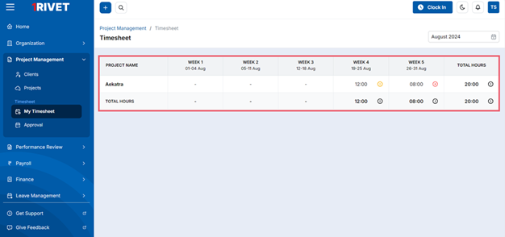

On the mobile, navigate to the Explore tab, where you will find the Project Management section.
There, you can view **"My Timesheet."**
The list of projects in which you are staffed will be displayed and along with it the weeks of the
current months will be displayed. 

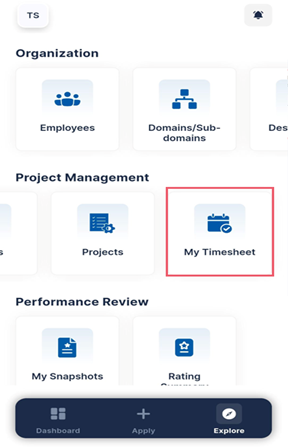 &nbsp;&nbsp;&nbsp;&nbsp;&nbsp;&nbsp;&nbsp;&nbsp;&nbsp;
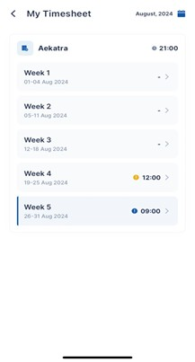

To add the task in the specific project, click on the project name and you will see the below screen,
from where you can fill the timesheet for desired weeks. To add task, click on the **“Add Task”** button.

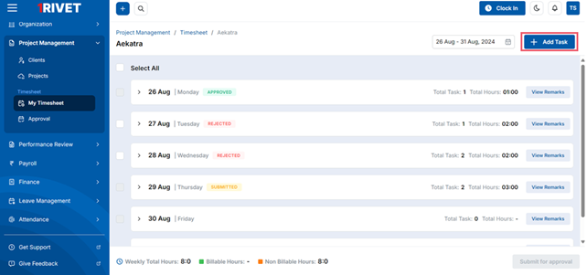

In mobile, after selecting the desired week, you can see the view of that week’s timesheet. You can
add your tasks from the **(+)** button.

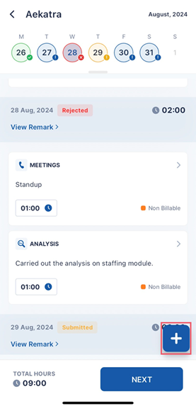

After you click on the add task button, you need to add/select the following details:
  - Date
  - Task Category
  - Task Description
  - Task Hours
  - Billing Type

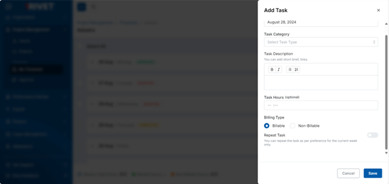

Once you have saved the details of the tasks, they will be displayed in the timesheet along with the
hours and all the other information that was entered by you while adding the task.
You can update the hours by clicking the edit icon against each task, you can also use the action
button to either modify or delete an existing task.

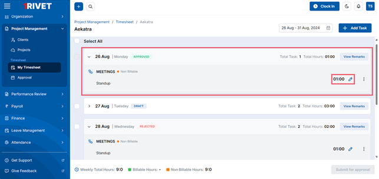

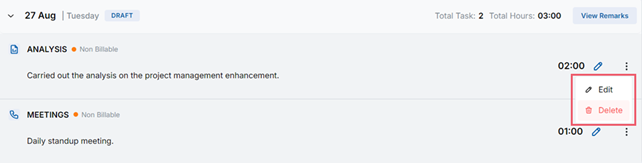

The tasks can be edited in the following states:
  - Draft
  - Submitted
  - Approved
  - Rejected
You can delete the tasks only if the manager hasn’t taken any action on them or if they are rejected.

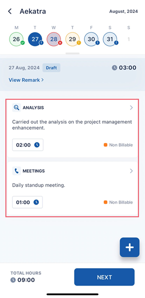

*Select any of the tasks for navigating to the task details screen, from where you can edit or delete the task.*

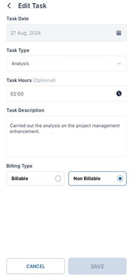

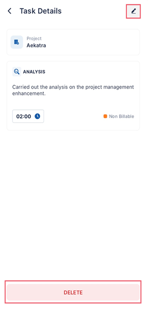

For mobile, you can select a single task and edit or delete it from the task details.

Once you have completed adding the tasks, you can select them and submit them by clicking on the **“Submit for Approval”** button. 

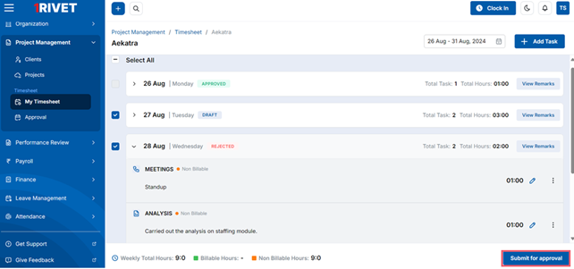

For mobile, once you have filled the timesheet, you can proceed to submit it. Click on the **“Next”** button, select the dates whose timesheet you want to submit and click on **“Submit”** button

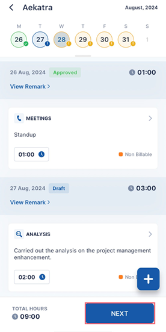 &nbsp;&nbsp;&nbsp;&nbsp;&nbsp;&nbsp;&nbsp;&nbsp;&nbsp;
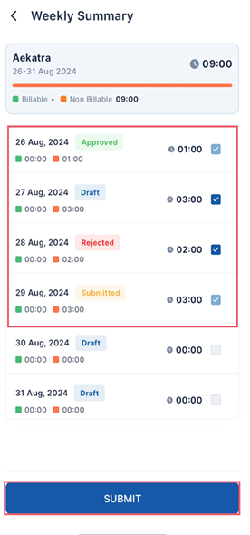

Upon submission, your timesheet will be sent to your reporting manager for review.

You can see the remarks which your reporting manager has added if your timesheet has been rejected.

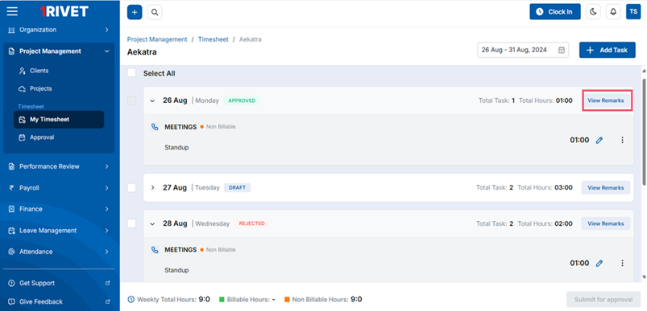

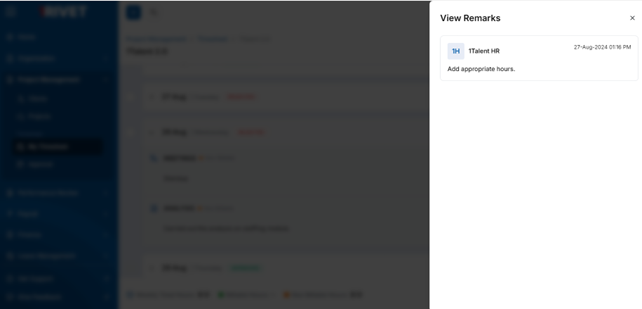

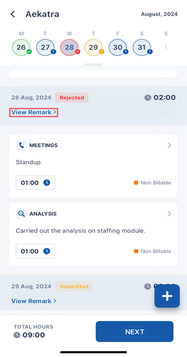 &nbsp;&nbsp;&nbsp;&nbsp;&nbsp;&nbsp;&nbsp;&nbsp;&nbsp;
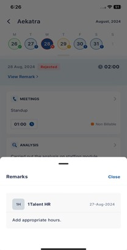

Below screen shows the summary of all the hours of a timesheet.

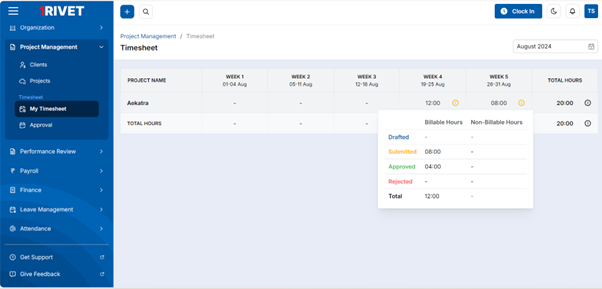

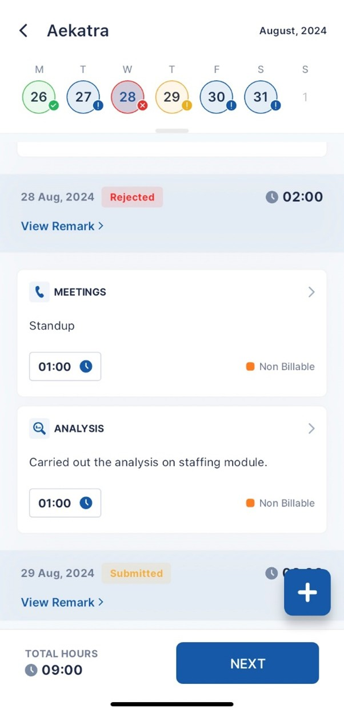

This screen shows the tasks, and the hours added for all the days of the selected week. 