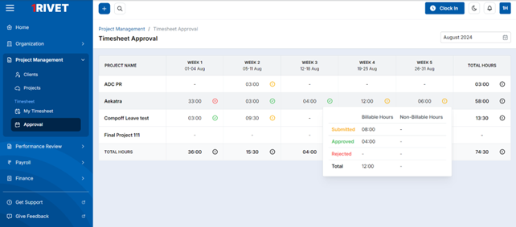
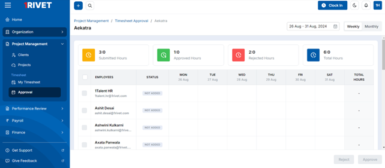
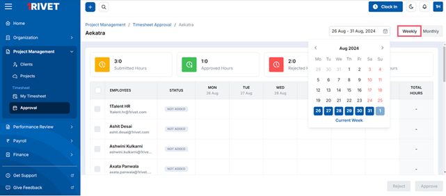
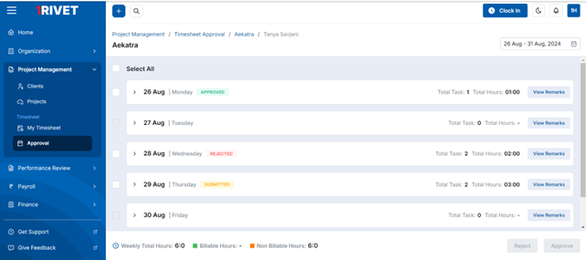
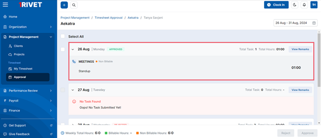
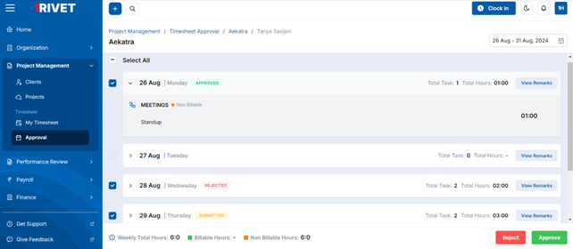
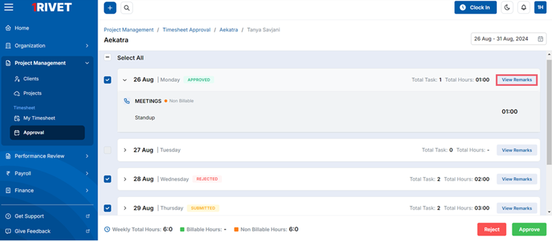
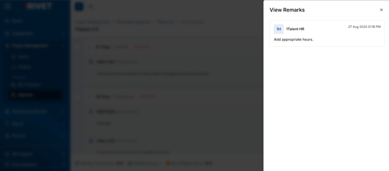
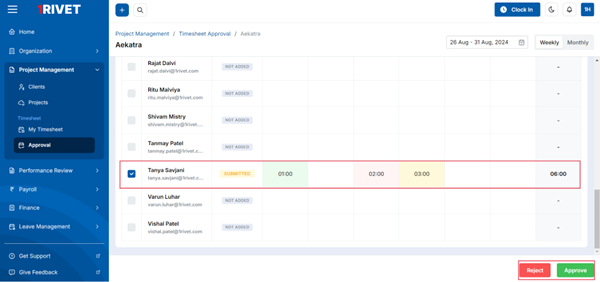

Access the Aekatra web or mobile app and navigate to **“Approval”** from the **“Project Management”** section of the Menu.

The reporting manager has the authority to review the timesheet and approve or reject it. The list of all the projects in which you are staffed as reporting manager would be displayed in the timesheet approval section.

On the listing screen, the manager can see the week-wise hours of each project. Also, the manager would be able to see the total hours for each project.

Click on any project from the list to open its detailed view.
Below is the week wise view of the project’s timesheet.
Here the manager can get the view of all the employees which are staffed in the project.

By default, a weekly view of the timesheet would be visible with the current week’s details on it. 
The desired week can be selected from the calendar.

The manager can select an employee to get a detailed view of its timesheet. By default, the current week’s timesheet would be displayed.

The manager will have visibility into all task details submitted by the employee in the timesheet and will have the ability to approve or reject each task individually of an individual.

Here the manager will have the ability to approve or reject the entire day's task on an individual basis.

If the manager rejects the timesheet, the system will ask for remarks while rejecting the timesheet.

**Note:** The manager can approve the timesheet, which was previously rejected and can reject the timesheet which was previously approved.

The manager can see the remarks added while rejecting the timesheet with the help of **“View Remarks”** option.

The manager can select the employees and approve or reject their timesheet with the **Approve** and **Reject** button.

If the manager has approved the timesheet of an employee, the status of timesheet would be shown as **"approved"** for that employee in the status column.

If an employee has not added any tasks, then the status would be displayed as “Not Added” for that employee in the status column.

If the manager has rejected the timesheet of an employee, the status of timesheet would be shown as “rejected” for that employee in the status column.

If the employee has submitted the timesheet, the status of timesheet would be shown as “submitted” for that employee in the status column.

If an employee has both an approved or rejected timesheet and a submitted timesheet, the status of the entire timesheet in the status column for that employee will be marked as “submitted”.